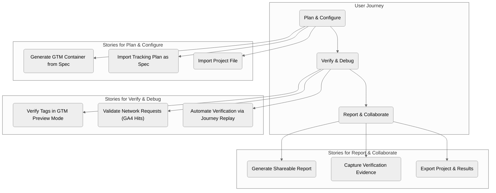

# TagCheck

TagCheck is an Nx monorepo for validating Google Tag Manager implementations,
replaying user journeys, and packaging those workflows into both web and
desktop surfaces. The workspace combines the main verification product, a
NestJS backend, a Tauri desktop shell, supporting Angular apps, and shared
libraries used across the platform.

## Overview

TagCheck is designed for QA, development, and analytics teams that need a
repeatable way to inspect GTM preview behavior, validate production analytics,
and share verification evidence. The repo is broader than a single desktop app:
the desktop shell is one delivery surface on top of a multi-project workspace.

## Workspace Topology

- `apps/ng-frontend`: primary Angular frontend for the TagCheck verification
  workflow
- `apps/nest-backend`: NestJS backend that powers project storage, automation,
  and reporting
- `apps/desktop-tauri`: Tauri desktop shell and packaging targets
- `apps/ng-tag-build`: Angular UI for building GTM-friendly specifications
- `apps/ng-product-doc`: Angular product documentation site
- `apps/ng-gtm-sample`: sample Angular site for GTM and analytics validation
- `apps/*-e2e`: browser e2e projects for the frontend and sample app
- `libs/data-access`, `libs/ui`, `libs/shared-styles`, `libs/utils`: shared
  workspace libraries

## Product Direction

- `TagCheck` is the main verification product and is still evolving around
  end-to-end verification and reporting flows.
- `Tag Build` is already available in production at
  [tag-build.vercel.app](https://tag-build.vercel.app/).
- `Product documentation` is already available in production at
  [tag-check-documentation.vercel.app](https://tag-check-documentation.vercel.app/).


```mermaid
%%{init: {'theme': 'neutral'}}%%
graph TD
    subgraph A [User Journey]
        direction LR
        B(Plan & Configure) --> C(Verify & Debug) --> D(Report & Collaborate)
    end

    subgraph Stories_Plan [Stories for Plan & Configure]
        direction TB
        B --> P1("Generate GTM Container from Spec")
        B --> P2("Import Tracking Plan as Spec")
        B --> P3("Import Project File")
    end

    subgraph Stories_Verify [Stories for Verify & Debug]
        direction TB
        C --> V1("Verify Tags in GTM Preview Mode")
        C --> V2("Validate Network Requests (GA4 Hits)")
        C --> V3("Automate Verification via Journey Replay")
    end

    subgraph Stories_Report [Stories for Report & Collaborate]
        direction TB
        D --> R1("Generate Shareable Report")
        D --> R2("Capture Verification Evidence")
        D --> R3("Export Project & Results")
    end
```

## Core Capabilities

- Generate GTM-compatible JSON specifications for repeatable verification runs
- Replay user journeys and record verification sessions as `.webm` videos
- Inspect unpublished tags through GTM preview mode with shareable entry flows
- Capture requests and reconstruct data layer objects for validation
- Produce XLSX reports with data layer output, raw requests, reconstructed
  payloads, and event screenshots
- Archive projects as `.zip` files so they can move between users and machines


## Quality Snapshot

[](https://sonarcloud.io/summary/new_code?id=WodenWang820118_tag-check)
[](https://sonarcloud.io/summary/new_code?id=WodenWang820118_tag-check)
[](https://sonarcloud.io/summary/new_code?id=WodenWang820118_tag-check)
[](https://sonarcloud.io/summary/new_code?id=WodenWang820118_tag-check)
[](https://sonarcloud.io/summary/new_code?id=WodenWang820118_tag-check)
[](https://sonarcloud.io/summary/new_code?id=WodenWang820118_tag-check)
[](https://sonarcloud.io/summary/new_code?id=WodenWang820118_tag-check)
[](https://sonarcloud.io/summary/new_code?id=WodenWang820118_tag-check)

## Prerequisites

This repository pins its toolchain in `package.json`:

- `Node.js 24.x`
- `pnpm 11.0.8` via Corepack

Recommended setup:

```bash
corepack enable
corepack prepare pnpm@11.0.8 --activate
pnpm install
```

If pnpm reports blocked dependency build scripts, review and approve them:

```bash
pnpm approve-builds
```

If the Nx cache gets into a bad state, prefer:

```bash
pnpm nx reset
```

## Common Development Commands

Run the main web app and backend together:

```bash
pnpm run dev-app
```

Run individual surfaces:

```bash
pnpm run dev-front
pnpm run dev-back
pnpm run dev-tauri
pnpm run dev-tag-build
pnpm run dev-product-doc
pnpm run dev-ng-gtm-sample
```

Locale-specific `Tag Build` development:

```bash
pnpm run dev-tag-build:ja
pnpm run dev-tag-build:zh-Hans
pnpm run dev-tag-build:zh-Hant
```

Storybook:

```bash
pnpm run storybook-front
```

## Testing And Coverage

Prefer Nx-backed package scripts instead of calling underlying tools directly.
Normal test commands stay non-coverage by default; coverage is opt-in through
dedicated scripts.

Backend verification:

```bash
pnpm run test-back:unit
pnpm run test-back:integration
pnpm run test-back:e2e
pnpm run test-back:cov
pnpm run test-back:e2e:cov
```

Browser e2e verification:

```bash
pnpm run test-front:e2e
```

Workspace and Sonar coverage merge:

```bash
pnpm run test:cov
```

Notes:

- `pnpm run test:e2e` is an alias for the backend e2e path.
- Backend e2e coverage writes to `coverage/apps/nest-backend-e2e` so it does
  not overwrite backend unit coverage.
- `pnpm run coverage:merge` writes the merged Sonar report to
  `coverage/lcov.info`.
- `INCLUDE_E2E_COVERAGE=1 pnpm run coverage:merge` intentionally folds backend
  e2e coverage into the merged artifact when needed.

## Build And Packaging

Build the main production frontend and backend:

```bash
pnpm run build-prod
```

Build individual delivery surfaces:

```bash
pnpm run build-front
pnpm run build-back
pnpm run build-tag-build
pnpm run build-product-doc
pnpm run build-ng-sample-site
pnpm run build-tauri
pnpm run bundle-tauri
pnpm run bundle-tauri:windows
pnpm run bundle-tauri:macos
pnpm run bundle-tauri:linux
```

Desktop packaging now uses the Tauri release helper in `apps/desktop-tauri`.
`pnpm run bundle-tauri` packages the current host platform, while the
platform-specific scripts make the Windows NSIS, unsigned Apple Silicon macOS,
and Linux AppImage release targets explicit.

The cross-platform desktop release workflow, artifact names, and operator
runbook live in [docs/desktop-release.md](./docs/desktop-release.md).

## Review Workflow

This repo uses review gates for non-trivial work. The most common commands are:

```bash
pnpm review:status
pnpm review:plan
pnpm review:test
pnpm review:implementation
pnpm review:approve-pre-implementation -- --reviewer <id> --focus <area> --summary "<summary>"
pnpm review:reset
```

Detailed agent workflow and reviewer routing live in [AGENTS.md](./AGENTS.md).

## Generated Local Data

The backend's production-style project storage uses the `tag_check_projects`
folder at the repository root. That folder is created locally when the backend
starts in the relevant mode.

## Feedback And Contribution

Feedback and contributions are welcome. If you find an issue, have a product
suggestion, or want to improve the workflow, please open an issue or submit a
pull request with the relevant context.
