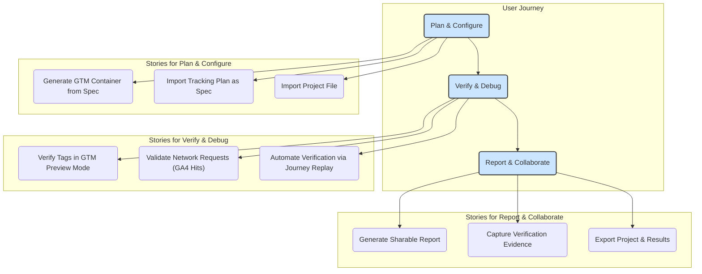

# TagCheck (Beta)

## Table of Contents

- [Overview](#overview)
- [Features](#features)
- [Development](#development)
  - [Current Status](#current-status)
  - [Prerequisites](#prerequisites)
  - [Frontend (Angular)](#frontend-angular)
  - [Backend (NestJS)](#backend-nestjs)
  - [Electron](#electron)
  - [Storybook](#storybook)
- [Build and Production](#build-and-production)
  - [Build](#build)
  - [Package](#package)
  - [Make](#make)
- [Feedback and Contribution](#feedback-and-contribution)

Overall Project Health

[](https://sonarcloud.io/summary/new_code?id=WodenWang820118_tag-check)
[](https://sonarcloud.io/summary/new_code?id=WodenWang820118_tag-check)
[](https://sonarcloud.io/summary/new_code?id=WodenWang820118_tag-check)

Code Quality Metrics

[](https://sonarcloud.io/summary/new_code?id=WodenWang820118_tag-check)
[](https://sonarcloud.io/summary/new_code?id=WodenWang820118_tag-check)
[](https://sonarcloud.io/summary/new_code?id=WodenWang820118_tag-check)

Project Size and Test Coverage

[](https://sonarcloud.io/summary/new_code?id=WodenWang820118_tag-check)
[](https://sonarcloud.io/summary/new_code?id=WodenWang820118_tag-check)

## Overview

This desktop application automates the Google Tag Manager (GTM) container review process and production analytics deployment validation. It streamlines the quality assurance process by providing:

1. **GTM Container Review**: Load GTM preview mode, run Chrome recorder, and generate dataLayer correctness reports. Users can review tag configurations through GTM preview mode.
2. **Production Analytics Validation**: Validate analytics on the production website, ensuring dataLayer accuracy.

Designed for QA, development, and analytics teams, this free standalone tool leverages Angular, NestJS, and Electron.

## Features

- **Unified JSON Format**: Generate GTM-compatible JSON files and run different recorded tests using a consistent specification.
- **Video Recording**: The entire process is recorded as a .webm video.
- **GTM Accompanied Mode**: Observe unpublished tags within GTM using a shareable link and the website's landing page.
- **Request Capture**: Efficiently capture and validate tags automatically. Captured requests are recomposed to data layer object for validation.
- **XLSX Report**: Test results are encapsulated in an XLSX report, including:
  - Data layer
  - Raw captured requests
  - Reconstructed data layer based on raw captured requests
  - Screenshots of event triggers
- **Project Transfer**: Archive projects as .zip files for import into other users' applications.

  

## Development

This project uses LTS NodeJS v22.13.0 npm v10.9.2 for development. If cannot compile, please run `nx reset` and `rm -rf .nx` to reset the project. Please refer to the `package.json`'s `engines` field for the exact version.

### Current Status

- TagBuild is already in [production stage](https://tag-build.vercel.app/) but subject to change by the Google Tag Manager team.
- Documentation site is already in [production stage](https://tag-check-documentation.vercel.app/) but subject to change by users' feedback.



### Prerequisites

Install dependencies:

```bash
npm install -g pnpm
```

```bash
pnpm install
```

Approve the build for the listed packages warned by pnpm after installation:

```bash
pnpm approve-builds
```

### Frontend (Angular)

For development:

```bash
pnpm run dev-front
```

### Backend (NestJS)

For development:

```bash
pnpm run dev-back
```

### Electron

For Electron development with a development server:

```bash
pnpm run dev-electron
```

### Storybook

For Storybook development:

```bash
pnpm run storybook-front
```

## Build and Production

### Build

Compile the application:

```bash
pnpm run build-prod
```

Output folders (in `dist/apps`):

- `ng-frontend`
- `nest-backend`

### Package

Build the Electron app:

```bash
pnpm run package
```

Output will be in the `out` folder.

### Make

Generate a OS-based zip file:

```bash
pnpm run make
```

The building efficiency depends on the machine performance. The first time running the app usually takes longer.

### Debugging

When debugging with unexpected crashes such as `electron-forge make`

```bash
DEBUG=electron-forge:\* pnpm electron-forge make
```

### Actual project and end-to-end tests

The example project is located at the `tag_check_projects` folder at the root directory. An example project is automatically built after app activation and utilized for end-to-end tests for both backend and frontend. Moreover, the project is also used for development purposes.

## Feedback and Contribution

We welcome your feedback and contributions! If you have suggestions or encounter issues, please file them in the issues section. For those interested in contributing, check out our contribution guidelines (coming soon).
